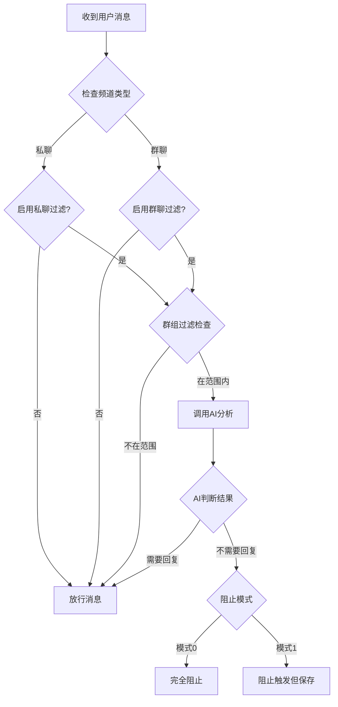

# AI自主判断是否回复

通过AI模型智能分析消息内容，判断是否需要触发回复。支持私聊/群聊独立配置和群组过滤。

**🎉 v1.2 优化**: 精简配置项，更易用！

## 功能特性

- ✅ **AI智能判断**: 使用AI模型分析消息内容，决定是否需要回复
- 🆕 **自动人设识别**: 自动从数据库读取频道配置的人设，无需手动配置
- 🆕 **智能上下文感知**: 自动获取历史聊天记录，理解对话连贯性
- ✅ **私聊/群聊独立控制**: 可分别为私聊和群聊设置不同的过滤规则
- ✅ **群组过滤**: 支持群组白名单和黑名单，精确控制生效范围
- ✅ **自定义提示词**: 可自定义AI判断的系统提示词
- ✅ **智能缓存**: 自动缓存AI判断结果，减少重复调用

## 安装

将插件文件夹放置在 Nekro Agent 的 `plugins/workdir/` 目录下，重启 Agent 即可自动加载。

## 配置说明

### 基础配置

| 配置项 | 类型 | 默认值 | 说明 |
|--------|------|--------|------|
| 启用私聊过滤 | 布尔值 | true | 是否在私聊频道启用AI智能过滤功能 |
| 启用群聊过滤 | 布尔值 | true | 是否在群聊频道启用AI智能过滤功能 |
| AI分析模型组 | 字符串 | "default" | 用于消息分析的AI模型组名称 |

### 群组过滤配置

| 配置项 | 类型 | 默认值 | 说明 |
|--------|------|--------|------|
| 群组过滤模式 | 整数 | 0 | 0=禁用群组过滤，1=白名单模式（仅列表中的群组生效），2=黑名单模式（排除列表中的群组） |
| 群组ID列表 | 数组 | [] | 群组ID列表，用于白名单或黑名单过滤 |

**群组ID格式**：通常为 `group_群号`，具体格式取决于适配器平台。

### AI判断配置

| 配置项 | 类型 | 默认值 | 说明 |
|--------|------|--------|------|
| 自动使用频道人设 🆕 | 布尔值 | true | 是否自动从数据库读取当前频道关联的人设信息（推荐开启） |
| 上下文消息数量 | 整数 | 5 | 判断时包含的历史消息数量，0=不使用上下文，建议5-10条 |
| AI判断系统提示词 | 字符串 | (默认提示词) | 指导AI如何判断消息是否需要回复的系统提示词 |

## 使用场景

### 场景1: 智能过滤无意义消息

适用于过滤简短确认消息，避免不必要的回复：

```
用户: "嗯"
AI判断: 不需要回复 ❌

用户: "可以帮我写个Python函数吗？"
AI判断: 需要回复 ✅
```

**配置建议**：
- 启用私聊过滤: ✅
- 启用群聊过滤: ✅
- 使用默认系统提示词

### 场景2: 群组精准控制

只在指定的几个群组中启用AI过滤：

**白名单模式配置**：
- 群组过滤模式: 1（白名单）
- 群组ID列表: `["group_12345", "group_67890"]`

**黑名单模式配置**：
- 群组过滤模式: 2（黑名单）
- 群组ID列表: `["group_test", "group_spam"]`

### 场景3: 人设适配（自动模式）🆕

插件会自动从数据库读取频道配置的人设，无需手动配置！

**使用步骤**：
1. 在 Nekro Agent Web 管理界面中为频道配置人设
2. 或使用克隆群友插件生成人设并关联到频道
3. 插件会自动读取并使用该人设进行判断

**效果**：
- 编程助手人设 → 只回复编程相关问题
- 客服人设 → 只回复业务相关问题
- 闲聊人设 → 回复所有对话消息

### 场景4: 上下文感知

结合对话历史判断消息连贯性：

**配置示例**：
- 上下文消息数量: 5

AI会参考最近5条消息的上下文，更好地理解对话流程。

## 工作原理



## 常见问题

### Q: 如何获取群组ID？

A: 群组ID通常在日志中可以看到，格式为 `group_` 开头。也可以在测试时查看Agent日志输出的频道ID信息。

### Q: AI判断失败会怎样？

A: 如果AI调用失败或超时，插件会默认放行消息，避免阻塞正常对话。

### Q: 缓存机制如何工作？

A: 插件会对消息内容计算MD5哈希值，相同内容的消息会使用缓存的判断结果，避免重复调用AI。缓存默认有效期为5分钟。

### Q: 如何调试插件？

A: 查看Docker日志，搜索 "AI回复过滤器" 关键词：
```bash
docker logs -f nekro_agent | grep "AI回复过滤"
```

### Q: 系统提示词如何编写？

A: 系统提示词应该：
1. 明确告诉AI判断标准
2. 要求返回JSON格式的结果
3. 考虑不同场景（问题、闲聊、@提及等）
4. 可以结合人设信息进行定制

## 技术细节

### 依赖

- `nekro_agent.api.core`
- `nekro_agent.api.message`
- `nekro_agent.api.schemas`
- `nekro_agent.api.signal`
- `nekro_agent.models.db_chat_message`
- `nekro_agent.services.agent.openai`
- `nekro_agent.services.plugin.base`

### 消息回调

插件通过 `@plugin.mount_on_user_message()` 装饰器注册消息回调，返回值：
- `None`: 放行消息，正常处理
- `MsgSignal.BLOCK_TRIGGER`: 阻止AI响应但保存记录
- `MsgSignal.BLOCK_ALL`: 完全阻止且不保存记录

## 更新日志

### v1.2.0 (2025-11-21)
- 🎨 **配置优化**: 精简配置项，提升用户体验
- 🗑️ 移除 `ENABLE_CACHE` 配置项（缓存默认开启）
- 🗑️ 移除 `CACHE_EXPIRE_SECONDS` 配置项（固定为300秒）
- 🗑️ 移除 `AI_TIMEOUT` 配置项（固定为10秒）
- 🗑️ 移除 `BLOCK_MODE` 配置项（固定为模式1：保存记录）
- 📝 将技术细节配置硬编码，配置项从12个精简到8个
- 📝 更清晰的配置结构，更易于理解和使用

### v1.1.0 (2025-11-20)
- 🎉 **重大更新**: 自动读取频道人设功能
- 🎉 **重大更新**: 自动获取聊天记录上下文
- ✨ 新增 `AUTO_USE_PRESET` 配置项
- ✨ 新增 `get_channel_preset()` 函数自动读取人设
- ✨ 改进 `ai_should_reply()` 逻辑，使用数据库人设
- 📝 移除手动配置的 `PERSONA_CONTEXT` 字段
- 📝 调整默认上下文消息数量为 5 条
- 📝 优化日志输出，更详细的调试信息

### v1.0.0 (2025-11-20)
- ✨ 初始版本发布
- ✅ 支持私聊/群聊独立控制
- ✅ 支持群组白名单/黑名单
- ✅ AI智能判断功能
- ✅ 结果缓存机制
- ✅ 上下文感知
- ✅ 人设适配

## 许可证

MIT License

## 作者

xiaojiu (小九)

## 反馈

如有问题或建议，请提交Issue或Pull Request。
